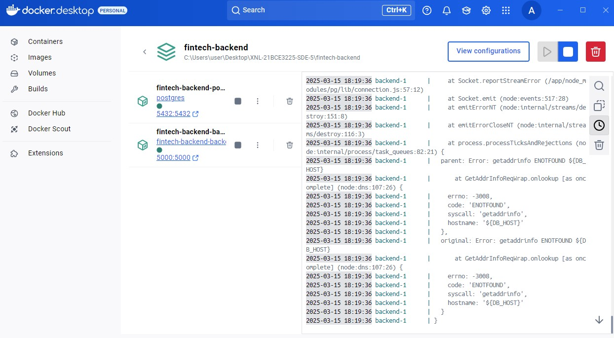
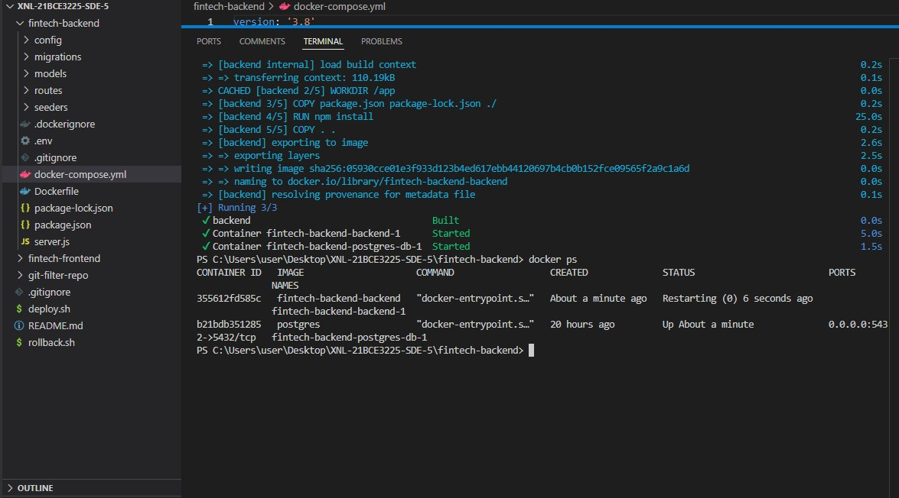

# XNL-21BCE3225-SDE-5

## 📌 Overview

This repository contains the **Fintech Frontend** project, designed for seamless financial transactions and user interactions. The project utilizes modern web technologies and includes **CI/CD pipelines** for smooth deployment.

## 📂 Project Structure

```
XNL-21BCE3225-SDE-5/
├── fintech-frontend/       # Main frontend application
├── deploy.sh               # Deployment script
├── rollback.sh             # Rollback script
├── docker-compose.yml      # Docker configuration
└── README.md               # Project documentation
```

## 🛠️ Prerequisites

Ensure you have the following installed:

- **Git**
- **Docker & Docker Compose**
- **Node.js & npm (if applicable)**

## 🚀 Deployment

To deploy the project, run the following command:

```sh./deploy.sh
```

This will:

1. Pull the latest changes from the `main` branch.
2. Build and start the containers using `docker-compose`.
3. Deploy the updated application.

## 🔄 Rollback

In case of any issues, rollback to the previous version using:

```sh./rollback.sh
```


1. Stop the current deployment.
2. Checkout to the previous commit.
3. Restart the deployment with the previous version.

### **Docker Running Containers**



## 📜 Git Best Practices

- Always work on a separate branch before merging into `main`.
- Use meaningful commit messages.
- Push changes only after testing locally.


